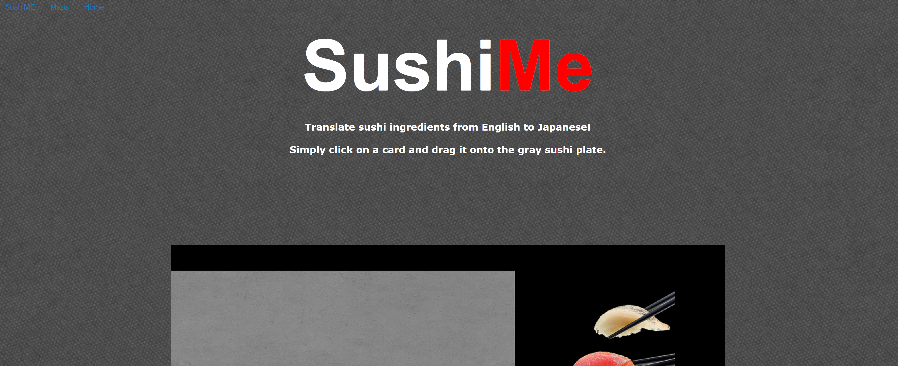
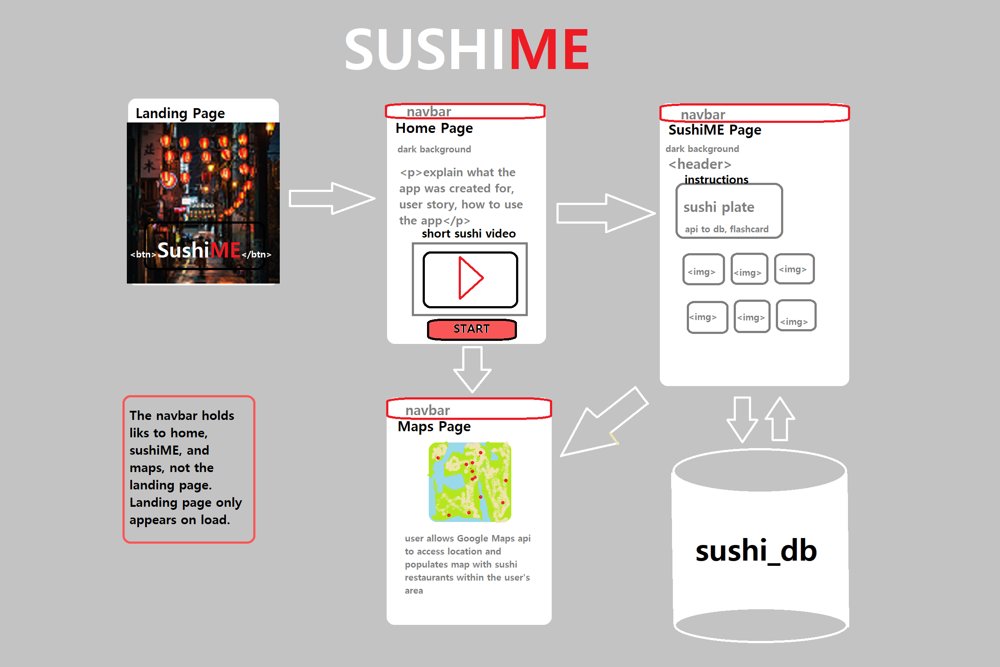

# github.io-SushiMe

## User Story

As an English speaker who is interested in Japanese food, I would like to become acquainted with common sushi ingredients, learn the Japanese translations for those sushi ingredients, and find a nearby sushi restaurant so that I can order sushi in Japanese.

## Screenshot

## Table of Contents

* [Description](#description)
* [What's Inside](#what's-inside)
* [UML](#uml)
* [Deployment](#deployment)
* [Technologies Used](#technologies-used)
* [Status](#status)
* [Authors](#authors)
* [License](#license)

## Description

The purpose of the project is to deliver a minimalist-styled learning application. 
The application is designed to make language flashcards useful for visiting a sushi restaurant.
The user enters the website by clicking on the SushiME 'Enter' button and is introduced to the application via the home page, sushiME page, and restaurant locator.
Users can select specific sushi flashcards (displayed in English) that will reveal the corresponding sushi ingredient in Japanese.
This page is formatted to be responsive to multiple viewports. 

## What's Inside

The webpage is comprised of:

1. landing page with Enter button
2. home page with Start button
3. sushiME page with interactive sushi ingredient flashcards
4. sushi restaurant locator page with Google Maps API

## UML

## Deployment

Webpage can be found via GirHub at this link: https://andreathomas19460.github.io/github.io-SushiMe/

OR via Heroku at this link: 

1. The landing page: the user is greeted and formally invited to enter the application; user clicks enter button (linked to home page)
2. The Home page: delivers description of the application and how to use with link to dynamic pages (Maps and SushiME)
3. The navbar: user can choose to navigate to home page, SushiME page, sushi restaurant map page
4. The SushiME page: user can select a flashcard with sushi ingredient image and name in English to reveal name in Japanese
5. The Maps page: user calls on Google Maps to search for the nearest sushi restaurants to their relative location; restaurant hours displayed when restaurant selected

## Technologies Used

* Font Awesome
* Microsoft Text to Translate
* Google Maps API
* Handlebars
* Foundation CSS Framework
* Node and Express
* MySQL
* Heroku

## Status

In progress

## Authors

Teresa Liu,
Jared Kong,
Andrea Thomas

## License 

This project is licensed under the GNU General Public License. See the gnuLICENSE.md for details. 